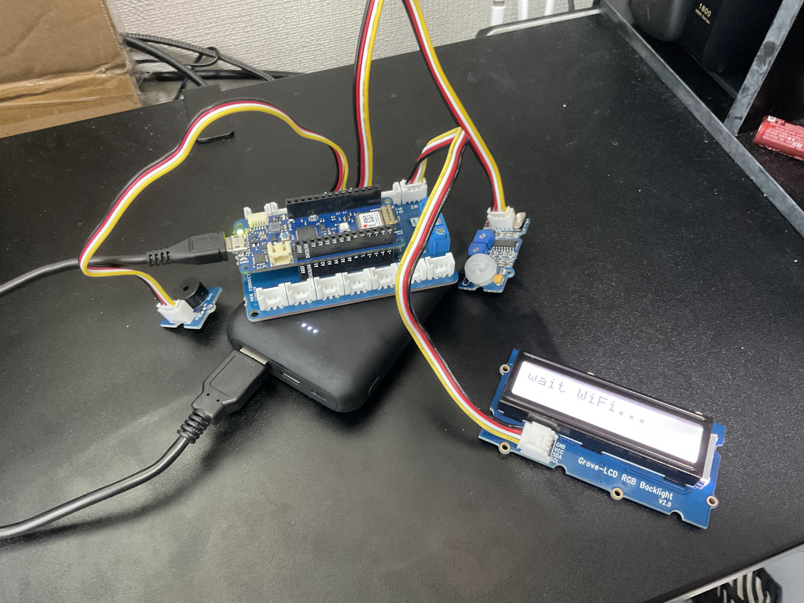
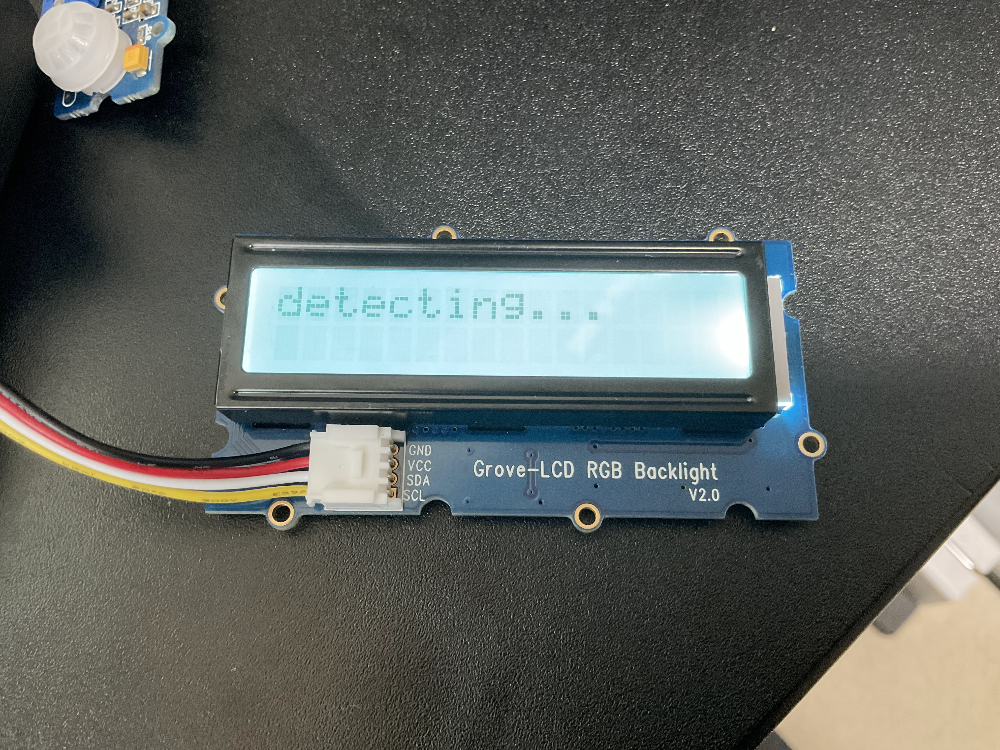
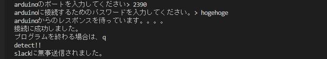
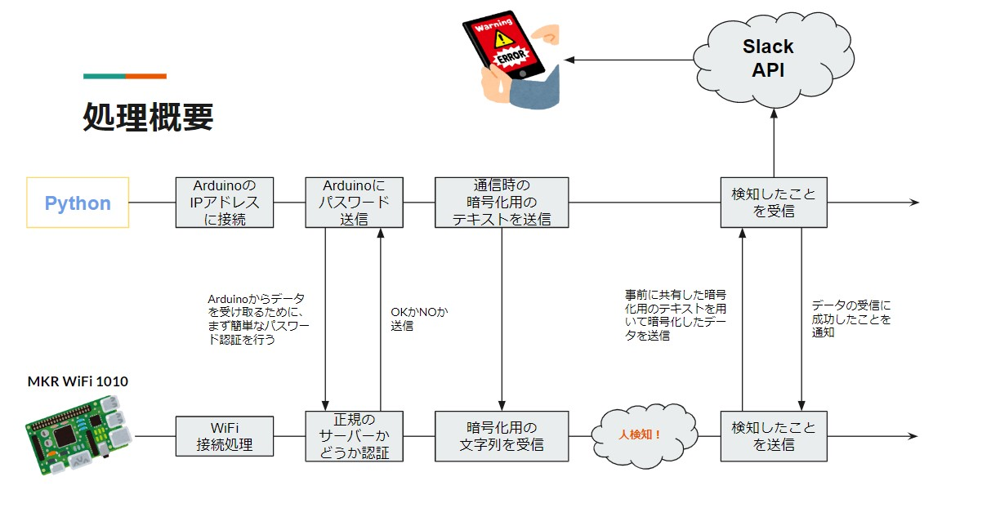

# 人を検知してSlackに通知、通信の暗号化
これは、Arduinoを用いて作られた、人を検知してSlackに通知するプログラムである。また、独自の暗号化プロトコルを考え通信の暗号化にも挑戦した。

# DEMO
### 全体

### 人を検知する時

### サーバー側のプログラムのログ

### Slackの通知画面

### 処理概要


# Features
作成動機としては、家に不審者が入ってきたらすごく嫌なので、せめて入ってきたことを検知できる物を作って見たいと思ったからである。

このプログラムの苦労した点としては、独自の暗号化プロトコルを考え通信の暗号化をした点である。毎回「検知した！」という変化の無い内容をサーバー側に送信し続けるのは、セキュリティ上良くないと思い、同じ内容を送る時でも実際に通信路を流れている情報は毎回変化するように通信を暗号化した。
### プロトコルの概要
1. まず、32文字のランダムな文字列を作成し、互いに共有する。
2. 送信側は、その文字列から1文字取り出し、それを送る内容の最後に追加、そして、SHA256でハッシュ化する。（文字列から1文字取り出すのは、最初から順番。最後まで来たらまた最初から）
3. データを受信した側は、送られて来るべき内容と、ランダムな文字列から相手と同じ手順で取り出した1文字とを組み合わせた文字列をSHA256でハッシュ化する。それが、受信した内容と比較し問題無ければ通信成功。

> ※お互いに暗号化する前の送信する内容は、事前に決めておく必要がある。<br>
> ex)　「検知した！」→「2」

# Requirement
## device
- MKR WiFi 1010
- Grove-LCD Backlight
- PIR Motion sensor
- BUZZER

## Language
- Python3
- Arduino(C++)

## Library
### Arduino
- WiFiNINA
- Crypto

### Python
- Slack SDK

## API
- Slack API

# Usage
## Pythonの環境構築
1. 仮想環境の構築
    ```
    $ python -m venv venv
    ```
2. アクティベート

    Mac, Linux
    ```
    $ source venv/bin/activate
    ```
    Windows
    ```
    $ .\venv\Scripts\activate
    ```
3. ライブラリのインストール
    ```
    $ pip install -r requirements.txt
    ```
4. .envファイルの作成<br>SlackのAPIを取得し、`env-template.txt`にしたがって`.env`ファイルを作成

## Arduino
1. `arduino_secrets.h`の各項目を接続するWiFiに合わせる。<br>`SECRET_ARDUINO_PASS`は、サーバーの認証を行う際に必要となるもの。任意に決めて大丈夫。
2. BUZZERは`D3`へ
3. PIR Motion sensorは`D4`へ
4. Grove-LCDは`I2O`へ
5. WiFiNINAとCryptoライブラリは`ツール > ライブラリを管理...`からインストール可能

# Notes
これは大学の授業で自分が作ったものです。